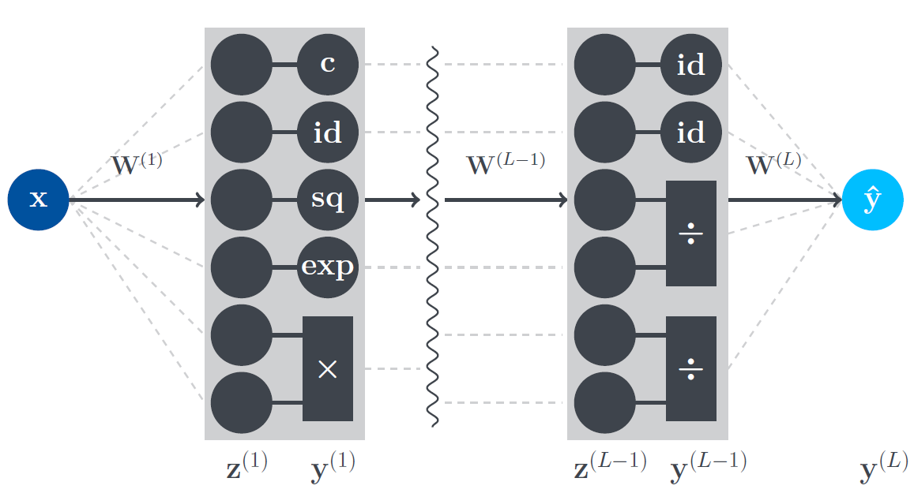

# Symbolic-Layered Neural Network (SyLaNN)

The Symbolic-Layered Neural Network predicts an analytical equation (correlation) from a given dataset. Its architecture is based off the equation learner approach (EQL) and in the same way the SyLaNN consists of customized hidden layers in which mathematical operators are defined. Possible choices of mathematical operators include the identity function, a constant, the square function, the exponential function, multiplication and division.

